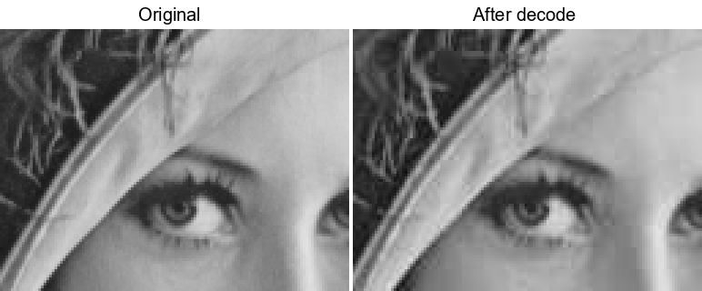

# EzCodec

A simple DCT-based image compression tool written in C++17.

This is a cleaned-up version of my old **EasyDCT** project — originally a Visual Studio-only Windows app with hardcoded paths. Now it has a proper CLI, cross-platform CMake build, and a custom `.ezc` binary format with separate encode/decode operations.

## What it does

Implements a JPEG-style compression pipeline for grayscale images:

```
PNG -> 8x8 blocks -> Forward DCT -> Quantization -> .ezc file
.ezc file -> Dequantization -> Inverse DCT -> Reconstruction -> PNG
```

- Naive O(n^4) DCT implementation (educational, not optimized)
- Standard JPEG luminance quantization table with adjustable quality (1-100)
- Multi-threaded processing via a custom thread pool
- Uses [stb_image](https://github.com/nothings/stb) for PNG I/O

### Example (quality = 50)

| Original | After encode/decode |
|:---:|:---:|
|  |  |

### Quality comparison




## Usage

```bash
# Encode a PNG image
ezcodec encode -i photo.png -o compressed.ezc -q 90

# Decode back to PNG
ezcodec decode -i compressed.ezc -o restored.png

# Help
ezcodec --help
```

**Options:**
| Flag | Description |
|------|-------------|
| `-i`, `--input` | Input file path (required) |
| `-o`, `--output` | Output file path (required) |
| `-q`, `--quality` | Compression quality 1-100, default 50 (encode only) |

## Build

Requires CMake 3.16+ and a C++17 compiler.

```bash
cmake -B build
cmake --build build --config Release
```

With tests:

```bash
cmake -B build -DEZCODEC_BUILD_TESTS=ON
cmake --build build --config Release
ctest --test-dir build -C Release
```

## Project structure

```
include/ezcodec/   - headers (Block, DCT, Quantization, ThreadPool, Codec, EzcFormat)
src/               - implementation files + CLI entry point
third_party/stb/   - vendored stb_image and stb_image_write
tests/             - unit tests
```

## What changed from EasyDCT

- Migrated from Visual Studio solution to CMake (Windows / Linux / macOS)
- Added CLI with encode and decode subcommands
- Custom `.ezc` binary format instead of hardcoded PPM output
- Output as PNG (via stb_image_write) instead of PPM
- Translated all comments to English
- Organized files into proper directory structure
- Separated core library from executable for testability
